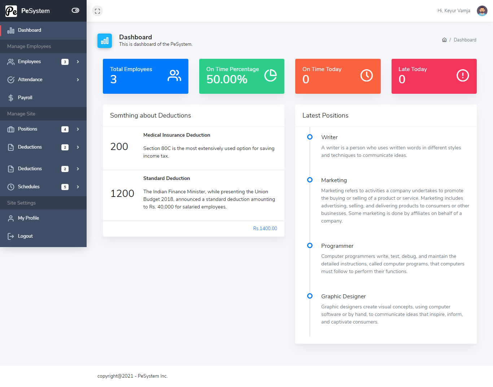
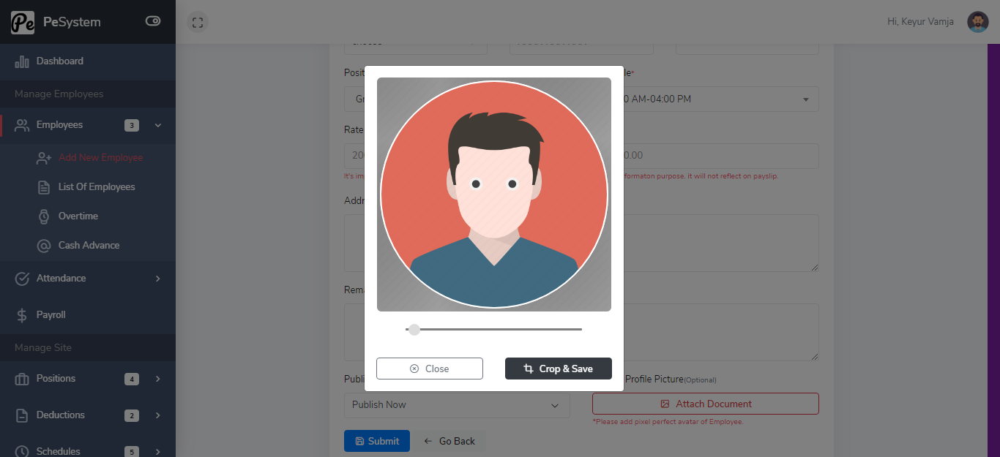
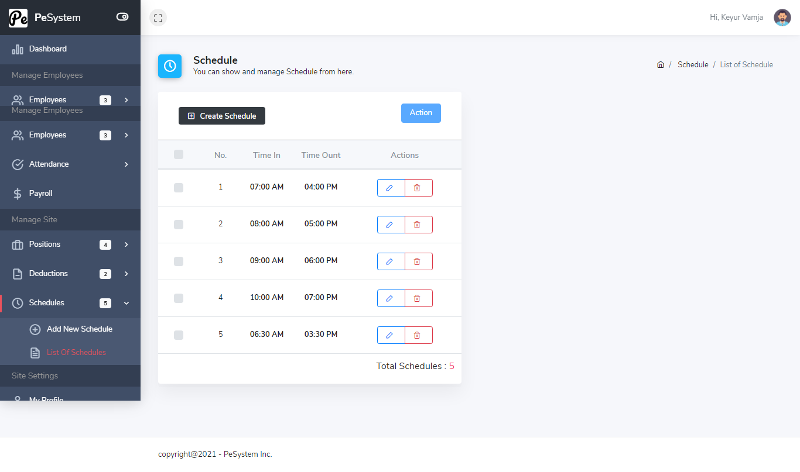
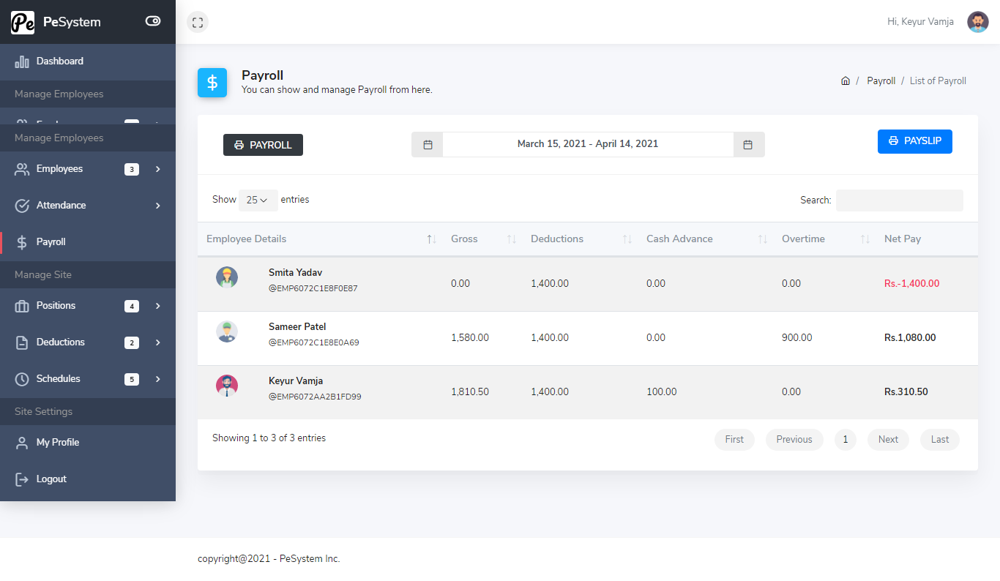
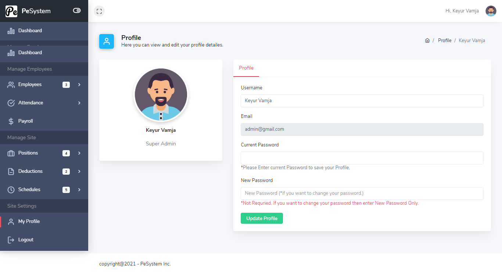

## PerforMax (Current: Laravel 5.8.*)

### Introduction
---
A system to track employee attendance across different branches, monthly salary calculations based on dynamic salary structures , best performer ("Employee of the Month") per branch and company-wide.


### Setup
---
Clone the repo and follow below steps.
1. Run `composer install`
2. Copy `.env.example` to `.env`
3. Set valid database credentials of env variables `DB_DATABASE`, `DB_USERNAME`, and `DB_PASSWORD`
4. Run `php artisan key:generate` to generate application key
5. Run `php artisan migrate --seed`
6. Run `php artisan serve` as per your environment

### Demo Credentials
---
*Make sure database is seed before you use these credentials.*

**User:** admin@gmail.com

**Password:** 123456

## ScreenShots

## Dashboard


## Employee Checkin/Out


## Employee Create


## Schedule


## Payroll


## Admin Profile


## Issues
If you have any issues please report them [here](https://github.com/Artyalert/PerforMax).


## Contribution
Please feel free to make any project-related pull requests. You should give us an email at the following addresses if you wish to propose any new updates or features to the project.

    1. Aryan Tyagi - aryantyagi2025@gmail.com

## How to deploy this project on AWS EC2 or any other VPS server using cmd

## Prerequisites

- AWS CLI installed and configured locally (with `aws configure`)  ([run-instances — AWS CLI 1.40.5 Command Reference](https://docs.aws.amazon.com/cli/latest/reference/ec2/run-instances.html?utm_source=chatgpt.com))  
- **AWS account** with permissions to create EC2 instances, key pairs, and security groups  ([run-instances — AWS CLI 1.40.5 Command Reference](https://docs.aws.amazon.com/cli/latest/reference/ec2/run-instances.html?utm_source=chatgpt.com))  
- **SSH key pair** (.pem) for accessing the EC2 instance  ([run-instances — AWS CLI 1.40.5 Command Reference](https://docs.aws.amazon.com/cli/latest/reference/ec2/run-instances.html?utm_source=chatgpt.com))  
- **Git** installed on local machine for cloning the repository  ([Deploy Laravel on AWS EC2 Ubuntu (nginx) - GitHub Gist](https://gist.github.com/ErxrilOwl/ecd9f5eac27697ad5bb91ca1a1759f32?utm_source=chatgpt.com))  
- **Ubuntu 20.04+** server (EC2 AMI or any VPS)  ([How To Install and Configure Laravel with Nginx on Ubuntu 20.04 ...](https://www.digitalocean.com/community/tutorials/how-to-install-and-configure-laravel-with-nginx-on-ubuntu-20-04?utm_source=chatgpt.com))  
- **Domain name** (optional) with an A-record pointing to the server’s public IP  

---

## Step 1: Provision EC2 Instance

1. **Create a security group:**  
   ```bash
   aws ec2 create-security-group \
     --group-name performax-sg \
     --description "Security group for PerforMax"
   ```  
   A security group acts as a virtual firewall controlling inbound/outbound traffic   

2. **Authorize ingress rules:**  
   ```bash
   aws ec2 authorize-security-group-ingress \
     --group-name performax-sg \
     --protocol tcp --port 22   --cidr 0.0.0.0/0
   aws ec2 authorize-security-group-ingress \
     --group-name performax-sg \
     --protocol tcp --port 80   --cidr 0.0.0.0/0
   aws ec2 authorize-security-group-ingress \
     --group-name performax-sg \
     --protocol tcp --port 443  --cidr 0.0.0.0/0
   ```  
   These commands open SSH (22), HTTP (80), and HTTPS (443) ports 

3. **Launch the EC2 instance:**  
   ```bash
   aws ec2 run-instances \
     --image-id ami-0123456789abcdef0 \
     --count 1 \
     --instance-type t2.micro \
     --key-name MyKeyPair \
     --security-groups performax-sg
   ```  
   Replace `ami-0123456789abcdef0` and `MyKeyPair` with your AMI ID and key pair name.
---

## Step 2: SSH and System Preparation

1. **Connect via SSH:**  
   ```bash
   ssh -i ~/MyKeyPair.pem ubuntu@YOUR_INSTANCE_PUBLIC_IP
   ```  
   Use the `ubuntu` user on Ubuntu AMIs  

2. **Update packages:**  
   ```bash
   sudo apt update && sudo apt upgrade -y
   ```  
   Ensures all system packages are current 

---

## Step 3: Install Dependencies

1. **Install PHP and extensions:**  
   ```bash
   sudo apt install php-cli php-fpm php-mbstring php-xml php-pdo php-mysql unzip -y
   ```  
   Required by Laravel for core functionality  

2. **Install Composer globally:**  
   ```bash
   curl -sS https://getcomposer.org/installer -o /tmp/composer-setup.php
   HASH=$(curl -sS https://composer.github.io/installer.sig)
   php -r "if (hash_file('SHA384', '/tmp/composer-setup.php') === '$HASH') { echo 'OK'; } else { echo 'FAIL'; unlink('/tmp/composer-setup.php'); } echo PHP_EOL;"
   sudo php /tmp/composer-setup.php --install-dir=/usr/local/bin --filename=composer
   ```  
   Composer manages Laravel’s PHP dependencies  
3. **Install Nginx:**  
   ```bash
   sudo apt install nginx -y
   ```  
   Serves PHP applications efficiently  

4. **(Optional) Install MySQL:**  
   ```bash
   sudo apt install mysql-server -y
   ```  
   If using a local database rather than a managed service 

---

## Step 4: Clone and Configure PerforMax

1. **Clone your repository:**  
   ```bash
   sudo mkdir -p /var/www
   cd /var/www
   sudo git clone https://github.com/Artyalert/PerforMax.git
   cd PerforMax
   ```  
   Places code under `/var/www` for web serving 

2. **Set file permissions:**  
   ```bash
   sudo chown -R www-data:www-data /var/www/PerforMax
   sudo chmod -R 755 /var/www/PerforMax/storage /var/www/PerforMax/bootstrap/cache
   ```  
   Ensures Nginx/PHP-FPM can write to cache and logs  

3. **Environment file:**  
   ```bash
   cp .env.example .env
   nano .env
   ```  
   Update `DB_*`, `APP_URL`, and other settings as needed  

4. **Install dependencies & generate key:**  
   ```bash
   composer install --no-dev --optimize-autoloader
   php artisan key:generate
   ```  
   Prepares vendor packages and application key  
---

## Step 5: Configure Nginx

1. **Create site configuration:**  
   ```bash
   sudo tee /etc/nginx/sites-available/performax.conf > /dev/null <<EOF
   server {
       listen 80;
       server_name your-domain.com;
       root /var/www/PerforMax/public;

       index index.php index.html;
       location / {
           try_files \$uri \$uri/ /index.php?\$query_string;
       }
       location ~ \.php$ {
           fastcgi_pass unix:/run/php/php8.2-fpm.sock;
           fastcgi_index index.php;
           include fastcgi_params;
           fastcgi_param SCRIPT_FILENAME \$document_root\$fastcgi_script_name;
       }
       location ~ /\.ht {
           deny all;
       }
   }
   EOF
   ```  
   Directs all requests to Laravel’s `public/index.php`  

2. **Enable and test:**  
   ```bash
   sudo ln -s /etc/nginx/sites-available/performax.conf /etc/nginx/sites-enabled/
   sudo nginx -t
   sudo systemctl reload nginx
   ```  
   Activates your site and reloads Nginx 
---

## Step 6: Migrate and Seed Database

```bash
cd /var/www/PerforMax
php artisan migrate --seed
php artisan config:cache
php artisan route:cache
php artisan view:cache
```  
Sets up tables, sample data, and optimizes performance 

## Step 7: Firewall and SSL (Optional)

1. **Configure UFW:**  
   ```bash
   sudo ufw allow OpenSSH
   sudo ufw allow 'Nginx Full'
   sudo ufw enable
   ```  
   Opens only necessary ports  

2. **(Optional) Obtain SSL via Certbot:**  
   ```bash
   sudo apt install certbot python3-certbot-nginx -y
   sudo certbot --nginx -d your-domain.com -d www.your-domain.com
   ```  
   Automates HTTPS setup  
---

## Applying to Any VPS

Simply skip **Step 1** (EC2 provisioning) and execute **Steps 2–7** on any Ubuntu VPS via the command line  ([How To Install and Configure Laravel with Nginx on Ubuntu 22.04 ...]

Your PerforMax application will now be live, secure, and optimized on AWS EC2 or any Ubuntu-based VPS.
